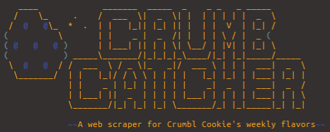

# Crumb Catcher



> A web scraper for this week's Crumbl Cookie flavors. 😋️

## Usage

1. Clone the repository.
2. Create and enter a virtual environment: e.g.
    ```bash
    $ python -m venv crumbcatcher-venv
    $ source crumbcatcher-venv/bin/activate
    ```
3. Install dependencies:
   ```bash
   $ python -m pip install -r requirements.txt
   ```
4. Run the script:
   ```
   $ python crumbcatcher.py
   ```
  
